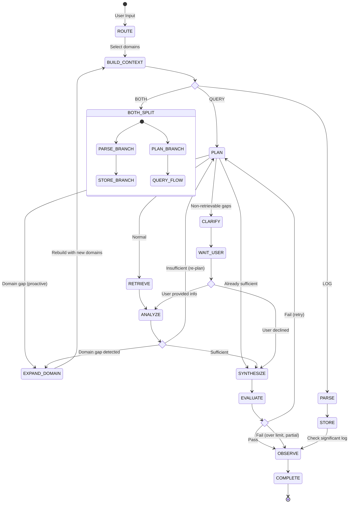
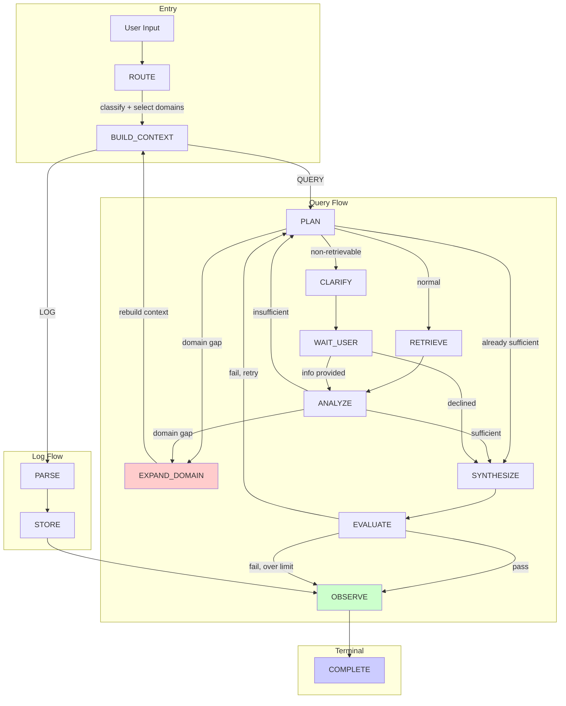
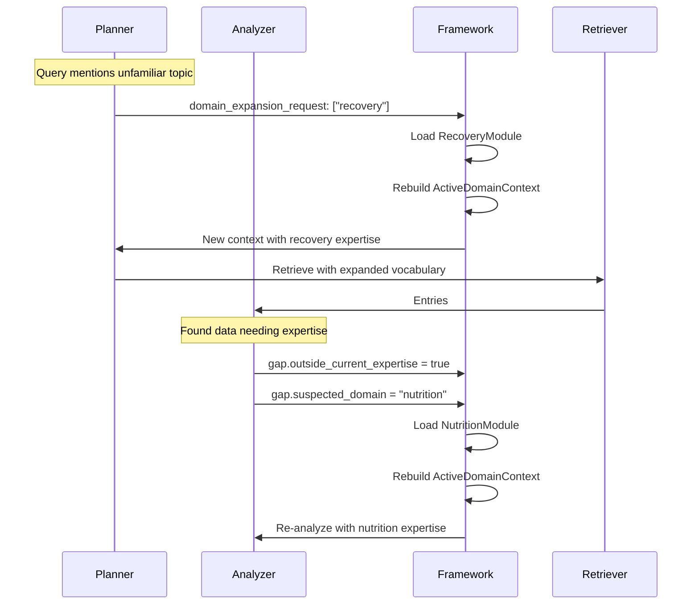
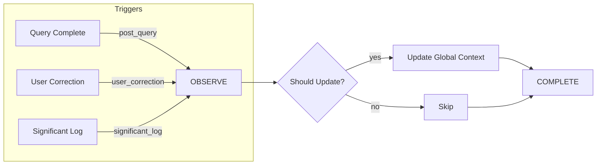

# Agent System State Machine

## Main Flow

## Query Flow Detail

## State Transitions Table

| From | To | Condition |
|------|-----|-----------|
| ROUTE | BUILD_CONTEXT | Always (domains selected) |
| BUILD_CONTEXT | PLAN | input_type == QUERY |
| BUILD_CONTEXT | PARSE | input_type == LOG |
| BUILD_CONTEXT | PLAN + PARSE | input_type == BOTH |
| PLAN | RETRIEVE | Normal planning |
| PLAN | EXPAND_DOMAIN | Proactive domain gap detected |
| PLAN | CLARIFY | Non-retrievable gaps exist |
| PLAN | SYNTHESIZE | Already have sufficient context |
| RETRIEVE | ANALYZE | Always |
| ANALYZE | SYNTHESIZE | verdict == SUFFICIENT |
| ANALYZE | PLAN | verdict == INSUFFICIENT |
| ANALYZE | EXPAND_DOMAIN | gap.outside_current_expertise |
| EXPAND_DOMAIN | BUILD_CONTEXT | Always (rebuild with new domains) |
| CLARIFY | WAIT_USER | Always |
| WAIT_USER | ANALYZE | User provided info |
| WAIT_USER | SYNTHESIZE | User declined |
| SYNTHESIZE | EVALUATE | Always |
| EVALUATE | OBSERVE | verdict == PASS |
| EVALUATE | PLAN | verdict == FAIL, retry_count < max |
| EVALUATE | OBSERVE | verdict == FAIL, retry_count >= max |
| PARSE | STORE | Always |
| STORE | OBSERVE | Always |
| OBSERVE | COMPLETE | Always |

## Domain Expansion Flow

## Observer Integration

